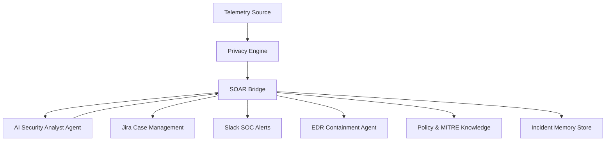

# NeoGrid SOAR Hub  
### Autonomous Agentic SOC Orchestration & Active Defense Platform

  
  
  
-orange)  


---

## 🧠 Overview

**NeoGrid SOAR Hub** is an enterprise-style **Agentic Security Operations Platform** that demonstrates how AI-driven reasoning, business context awareness, and automated response can eliminate Tier-1 alert fatigue and accelerate containment.

The platform combines:

- Cognitive AI analysis (Llama-3)
- Corporate policy intelligence
- MITRE ATT&CK mapping
- Threat reputation lookups
- Automated remediation

to mimic how a **real SOC team thinks, validates, and acts**.

---

## 🎯 The Problem NeoGrid Solves

| SOC Challenge | NeoGrid Solution |
|--------------|------------------|
| Alert fatigue & false positives | **Context-Aware Behavioral Triage** using asset ownership, business hours, and policy rules |
| Risk of sending sensitive logs to external LLMs | **PII Redaction Layer** sanitizes logs before AI analysis |
| Slow MTTC (Mean Time To Contain) | **Automated Host Isolation** for confirmed malicious activity |
| Duplicate alert flooding | **Stateful Deduplication** updates one Jira case instead of creating many |
| Inconsistent investigations | **Structured AI Forensic Reports** stored in Jira ADF format |

---

## 🧩 Agentic Architecture Model

NeoGrid follows an **Agentic SOC Model** where reasoning is centralized but powered by multiple knowledge sources and intelligence tools.

### 🧠 AI Security Analyst Agent (Core Agent)

The cognitive engine responsible for:

- Behavioral analysis  
- Account misuse detection  
- Policy-aware decision making  
- Final verdict generation  

The agent operates like a **Level-3 SOC Analyst**.

---

### 🔍 Integrated Intelligence & Knowledge Sources

| Component | Purpose |
|----------|--------|
| **Threat Intelligence Tools** | IP reputation and file hash checks |
| **MITRE ATT&CK Mapping** | Maps observed behavior to TTPs |
| **Corporate Policy RAG** | Distinguishes maintenance vs malicious behavior |
| **Asset Context Service** | Business hours, owner, and asset criticality |

These act as **specialist knowledge layers** supporting the main analyst agent.

---

## 🏗 Enterprise Architecture

The platform uses a **containerized microservices architecture** orchestrated with Docker.

| Service | Role |
|--------|------|
| **AI Analyst Service** | Llama-3 powered reasoning engine |
| **SOAR Bridge (FastAPI)** | Orchestration, policy enforcement, case management |
| **Privacy Engine** | PII redaction before AI processing |
| **State Manager** | Deduplication and incident memory |
| **Asset Service** | Business context enrichment |
| **Telemetry Generator** | Simulated EDR/XDR alerts |
| **Mock EDR Agent** | Simulated host isolation |

---

## 🔁 SOC Workflow (Sense → Think → Act)



---

## 🛡 Key Enterprise Features

### 1️⃣ PII Redaction Layer
Logs are sanitized before reaching the LLM:
- Emails  
- Internal usernames  
- Sensitive identifiers  

Ensures compliance and safe AI usage.

---

### 2️⃣ Policy-Over-Suspicion Logic
The system reduces false positives by prioritizing:

- Approved maintenance windows  
- Asset ownership  
- Corporate whitelists  

Suspicious ≠ malicious unless context confirms.

---

### 3️⃣ Stateful Deduplication
Recurring activity from the same source:
- Updates an existing Jira case  
- Appends evidence  
- Prevents alert storms

---

### 4️⃣ Automated Active Defense
If activity is confirmed malicious:
- Host isolation is triggered automatically  
- Slack SOC alert is sent  
- High-priority Jira ticket created

---

### 5️⃣ Human-in-the-Loop Oversight
False positives are:
- Archived, not deleted  
- Available for senior analyst audit  

This keeps AI accountable.

---

## ⚙️ Installation

### 1. Configure Environment
Create `.env` from `.env.example` and add:

- Jira API token  
- Slack webhook URL  

---

### 2. Launch the Platform

```bash
docker-compose up --build -d
```

---

## 🧪 Demo Scenarios

| Scenario | Command | Expected Result |
|---------|---------|-----------------|
| Malicious Threat | `docker-compose exec telemetry-gen python src/sender.py 1` | **[TP ALERT]** Jira case + Host Isolation + Slack alert |
| False Positive | `docker-compose exec telemetry-gen python src/sender.py 2` | **[AUTO-RESOLVED]** Archived ticket |
| Stress Test | `docker-compose exec telemetry-gen python src/batch_sender.py 10` | Deduplicated incidents, updated Jira case |

---

## 🧠 Outcome

NeoGrid SOAR Hub demonstrates how:

**AI reasoning + policy intelligence + automated containment**

can reduce SOC workload, improve decision accuracy, and accelerate response — shifting human analysts toward **Threat Hunting and Detection Engineering** instead of repetitive triage.
