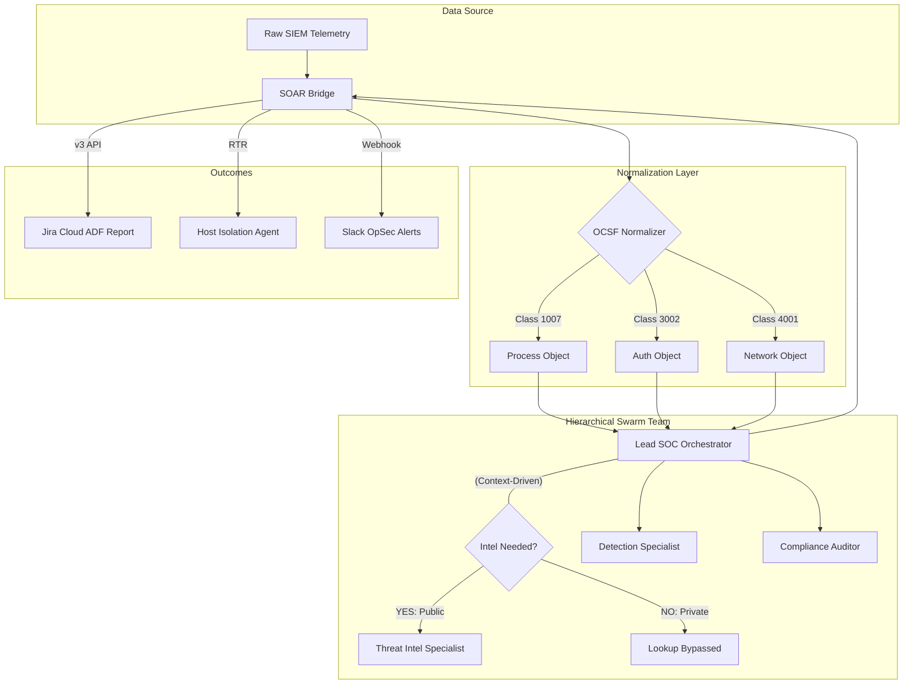

# NeoGrid SOAR Hub: OCSF-Native Autonomous SOC  
### Advanced Hierarchical Multi-Agent Swarm & Intelligent Schema Normalization


-orange)

**NeoGrid SOAR Hub** is a production-maturity security operations platform engineered for **high-fidelity, context-aware triage**. Moving beyond traditional rule-based automation, the platform utilizes an **OCSF 1.7.0 telemetry pipeline** and a **hierarchical AI agent swarm** to mimic a Tier-3 SOC team's investigative reasoning.

---

## 🧠 Architecture Philosophy — Think Before Act

The platform is designed as a **modular microservice ecosystem**, decoupling raw log collection from forensic reasoning.

---

## 1️⃣ Normalization Engine (OCSF 1.7.0)

Disparate raw telemetry (Linux Auditd, Windows Events, Splunk logs) is ingested and standardized into the **Open Cybersecurity Schema Framework (OCSF)**. This creates a **vendor-neutral data layer** for AI reasoning.

- **Process Activity [1007]** — High-integrity mapping of command-line data and parent-child ancestry  
- **Authentication [3002]** — Critical evaluation of logon types (RDP vs Local) and MFA status  
- **Network Activity [4001]** — Contextualizing traffic direction and infrastructure reputation  

---

## 2️⃣ Hierarchical Multi-Agent Swarm

A **Lead L3 SOC Orchestrator** acts as the director, autonomously delegating tasks to specialists based on the context of each OCSF object.

| Specialist | Function |
|------------|----------|
| 🕵️ **Threat Intel Specialist** | Queries reputation engines for **public infrastructure only** (skips RFC 1918 space) |
| 🛠 **Detection Specialist** | Maps standardized behaviors to the **MITRE ATT&CK framework** |
| 🏢 **Compliance & Policy Auditor** | Validates activity against **corporate whitelists** and maintenance windows |

---

## 3️⃣ Automated Response Loop

Dossiers are synthesized by the Director to execute a **closed-loop response**:

| Verdict | Action |
|--------|--------|
| **[MALICIOUS]** | Immediate host isolation via Mock EDR RTR module |
| **[AUTHORIZED]** | Zero-touch auto-resolution via Jira “Fail-Safe” rule |

---

## 🏛️ Real-World Transition: Policy Tuning & Scaling

NeoGrid is designed to scale from a lab environment to enterprise production **without refactoring core logic**.

- **Modular Asset Logic** — AssetService can pivot from CSV files to live CMDB APIs (ServiceNow, Snipe-IT, Active Directory)  
- **Policy Vetting (Tuning Sprint)** — Baselining historical traffic refines thresholds between *SUSPICIOUS* and *AUTHORIZED*  
- **Knowledge-Base Maturity** — Compliance Specialist supports integration with a **Vector Database (RAG)** of SOPs and governance PDFs  

---

## 🧪 Simulation & Validation

| Scenario | Objective | Logical Path | Final Outcome |
|----------|-----------|-------------|---------------|
| **Sudo Exploit** | Privilege Escalation | Root command detected → MITRE T1548 → Compliance flags unauthorized sudo | **[TP ALERT] Host Isolated** |
| **Admin Sync** | Noise Suppression | Policy whitelist match overrides TTP suspicion | **[AUTO-RESOLVED] Archived** |
| **10-Alert Storm** | Stress Testing | StateManager correlates rapid hits into one Jira ticket | **Deduplication Success** |

---

## 📊 System Logic Flow


```mermaid
graph TD
    subgraph Data Source
        A[Raw SIEM Telemetry] --> B[SOAR Bridge]
    end

    subgraph Normalization Layer
        B --> C{OCSF Normalizer}
        C -->|Class 1007| P[Process Object]
        C -->|Class 3002| AU[Auth Object]
        C -->|Class 4001| N[Network Object]
    end

    subgraph Hierarchical Swarm Team
        direction TB
        P & AU & N --> L[Lead SOC Orchestrator]
        L -- "(Context-Driven)" --- Gate1{Intel Needed?}
        Gate1 -->|YES: Public| T[Threat Intel Specialist]
        Gate1 -->|NO: Private| SK[Lookup Bypassed]
        L --> D[Detection Specialist]
        L --> C2[Compliance Auditor]
    end

    subgraph Outcomes
        L --> B
        B -->|v3 API| J[Jira Cloud ADF Report]
        B -->|RTR| E[Host Isolation Agent]
        B -->|Webhook| S[Slack OpSec Alerts]
    end
```

---

## 📁 Project Structure

```text
SOC-INTEGRATED-PLATFORM/
├── scripts/
├── services/
│   ├── ai-analyst/
│   ├── soar-bridge/
│   └── telemetry-gen/
├── shared/
└── docker-compose.yml
```

---

## 🛠 Technology Stack

| Layer | Technology |
|------|------------|
| **Languages** | Python 3.11 (FastAPI, Pandas, Pydantic) |
| **Agent Architecture** | Agno (Phidata), Llama-3.3-70B (Groq) |
| **API Layer** | FastAPI |
| **Infrastructure** | Docker Compose |
| **Standards** | OCSF 1.7.0, MITRE ATT&CK, RFC 1918 |
| **Workflow Engine** | **n8n (Centralized Orchestration)** |
| **Workflows & Integrations** | Atlassian Jira v3 (ADF Formatter), Slack Webhooks |

---

## 🎯 Final Milestone Confirmation

NeoGrid SOAR Hub provides an end-to-end blueprint for building a **context-aware autonomous security team**, transitioning from static scripts to **resilient, human-like investigative reasoning**.
