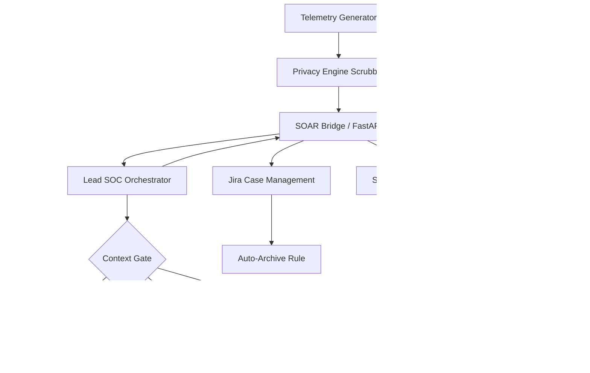

# NeoGrid SOAR Hub: Autonomous Agentic SOC  
### Advanced Multi-Agent Orchestration & High-Fidelity Active Defense

NeoGrid SOAR Hub is a high-maturity security operations platform that moves beyond standard automation. It implements a **Contextual Logic-Gate Orchestrator** where an AI Lead Analyst dynamically directs specialized expert agents only when the context of a security signal requires it.

The platform mirrors how a **Tier-3 SOC analyst leads a team**, reducing API overhead, eliminating alert fatigue, and automating reasoning-driven triage.

---

## 🚀 Main-Agent Orchestration Model

NeoGrid uses a **sequential expert-polling architecture** to optimize decision fidelity and resource efficiency.

### 🧠 Lead SOC Orchestrator (Main Agent)
The central reasoning engine. It evaluates telemetry and decides which specialist agents are required.

### 🕵️ Threat Intelligence Specialist  
Activated only for **public IP infrastructure**. Performs IP reputation and hash intelligence lookups.

### 🛠 Detection Specialist  
Analyzes command-line behavior and maps activity to **MITRE ATT&CK techniques**.

### 🏢 Compliance & Asset Specialist  
Evaluates activity against **corporate policy**, business hours, and asset criticality to identify approved exceptions.

---

## 🧩 Key Capabilities

- Agentic SOC reasoning architecture  
- Context-driven module activation  
- MITRE ATT&CK behavioral mapping  
- Corporate policy validation (RAG-based)  
- Privacy-first telemetry handling  
- Jira v3 structured forensic reporting  
- Stateful alert deduplication  
- Hybrid-SOAR automated containment  

---

## 🛡 Enterprise Governance & Performance

### 1. Privacy Shield Layer
Regex-based PII masking removes internal usernames, emails, and sensitive identifiers before AI processing.

### 2. Context-Gate Efficiency
The orchestrator bypasses unnecessary agents (e.g., skipping Threat Intel for private IPs) to reduce compute overhead.

### 3. Stateful Stress Resilience
Repeated alerts are merged into existing investigations, preventing ticket floods during alert storms.

### 4. Zero-Touch Triage
Authorized activity is auto-resolved and archived via Jira automation while maintaining audit visibility.

---

## 🧪 Simulation Scenarios

| Scenario | Objective | Logical Flow | Outcome |
|----------|-----------|-------------|---------|
| PowerShell Obfuscation | Detect malicious behavior | Detection maps T1059, Compliance flags violation | **[TP ALERT] Host Isolated** |
| Admin Sync | Validate policy exception | Compliance identifies approved maintenance | **[AUTO-RESOLVED] Archived** |
| Stress Run | Test resilience | Deduplication merges recurring alerts | No ticket flooding |

---

## 🛠 Installation & Setup

    git clone https://github.com/Naifnizami/NeoGrid-SOAR-Hub.git
    cd NeoGrid-SOAR-Hub
    cp .env.example .env
    docker-compose up --build -d

---

## 📊 Architecture Diagram

```mermaid
graph TD
    A[Telemetry Generator] --> H[Privacy Engine Scrubber]
    H --> B[SOAR Bridge / FastAPI]
    B --> C[Lead SOC Orchestrator]
    C --> Decision{Context Gate}
    Decision -->|Public IP| C1[Threat Intel Specialist]
    Decision -->|Always| C2[Detection Specialist]
    Decision -->|Always| C3[Compliance Specialist]
    C --> B
    B --> D[Jira Case Management]
    B --> E[Slack Alerts]
    B --> F[EDR Containment Agent]
    D --> G[Auto-Archive Rule]
```

---

### 🛡 Outcome

NeoGrid SOAR Hub demonstrates how **agentic orchestration + contextual policy intelligence + automated containment** can drastically reduce SOC workload while improving response speed, consistency, and governance.