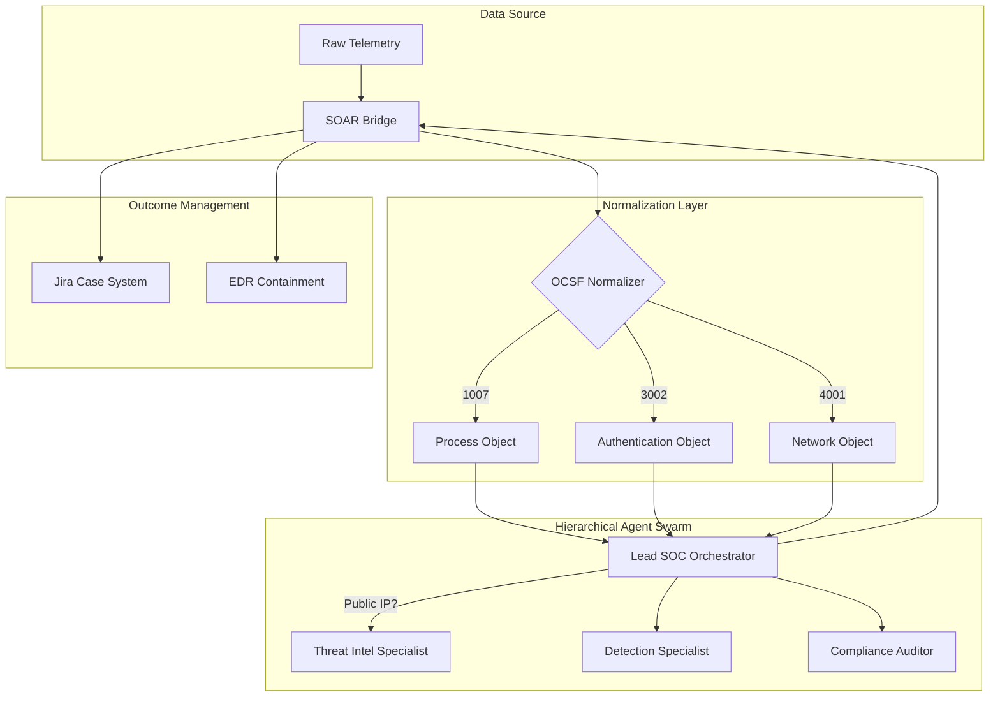

# NeoGrid SOAR Hub: OCSF-Native Autonomous SOC  
### Advanced Hierarchical Multi-Agent Swarm & Intelligent Schema Normalization


-orange)

**NeoGrid SOAR Hub** is a production-maturity security operations platform engineered for **high-fidelity, context-aware triage**.  
It goes beyond rule-based SOAR by combining **OCSF 1.7.0 telemetry normalization** with a **hierarchical AI agent swarm**, enabling automated reasoning that mirrors how a Tier-3 SOC team investigates incidents.

---

## 🧠 Architecture Philosophy — *Think Before Act*

NeoGrid separates detection and response into three intelligent layers.

---

## 1️⃣ Normalization Engine (OCSF 1.7.0)

The **SOAR Bridge** ingests raw EDR/XDR telemetry and converts it into **Open Cybersecurity Schema Framework (OCSF)** objects.  
This ensures consistent AI reasoning regardless of vendor log format.

### Supported OCSF Event Classes

| OCSF Class | Purpose |
|------------|---------|
| **Process Activity [1007]** | Analyzes process ancestry, command-line arguments, parent-child lineage, and integrity levels |
| **Authentication [3002]** | Evaluates login types (RDP vs Interactive), MFA presence, and account usage context |
| **Network Activity [4001]** | Contextualizes external connections, ingress/egress behavior, and infrastructure reputation |

This standardization allows the AI to reason using **behavioral semantics**, not raw log noise.

---

## 2️⃣ Hierarchical Multi-Agent Swarm (The AI SOC Team)

A **Lead L3 SOC Orchestrator** acts as the decision authority.  
It dynamically invokes specialists only when required, minimizing API overhead and improving verdict accuracy.

### 🧠 Lead SOC Orchestrator  
Primary reasoning engine. Synthesizes findings and issues final forensic verdicts.

### 🕵️ Threat Intelligence Specialist  
Activated only for **public infrastructure**. Performs IP and file-hash reputation lookups.

### 🛠 Detection Specialist  
Maps behavior to **MITRE ATT&CK techniques** based on OCSF-normalized process and network activity.

### 🏢 Compliance & Policy Auditor  
Evaluates signals against:
- Corporate maintenance windows  
- Asset criticality  
- Whitelists & approved operational patterns  

This layer enables **policy-over-suspicion logic**, dramatically reducing false positives.

---

## 3️⃣ Automated Decision & Response

Specialist reports are fused by the Lead Orchestrator to drive response:

| Verdict | Automated Action |
|--------|------------------|
| **[MALICIOUS]** | Host isolation via EDR RTR module |
| **[SUSPICIOUS]** | Structured Jira investigation created |
| **[AUTHORIZED]** | Auto-resolved & archived through Jira automation |

---

## 🛡️ Key Enterprise Capabilities

### 🔒 Privacy-First Processing
A dedicated **Privacy Engine** redacts emails, usernames, and internal identifiers before any data is processed by external LLMs.

### ⚙️ Context-Gated Intelligence
Threat Intel lookups are skipped for private IP space, conserving resources and prioritizing internal policy logic.

### 🧩 Stateful Memory & Deduplication
A JSON-based state manager correlates repeated alerts into existing Jira cases, preventing ticket floods during alert storms.

### 📊 Structured Case Reporting
Incidents are pushed using **Jira v3 ADF format**, ensuring machine-readable and human-friendly forensic records.

### 🧠 Resilient Swarm Design
Even if an external intelligence tool fails, the AI continues reasoning using behavioral analysis and corporate policy.

---

## 🧪 Simulation Scenarios

| Scenario | Objective | Logical Path | Outcome |
|----------|-----------|-------------|---------|
| Encoded PowerShell | Detect obfuscation | Detection maps MITRE T1059, policy violation found | **[TP ALERT] Host Isolated** |
| Admin Backup Task | Validate whitelist | Compliance agent confirms approved maintenance | **[AUTO-RESOLVED] Archived** |
| Alert Storm (10 events) | Stress test deduplication | State manager correlates recurring hits | No ticket flooding |

---

## 🛠 Technology Stack

| Layer | Technology |
|------|------------|
| Agent Framework | Agno (Phidata) |
| AI Model | Llama 3.3 (Groq) |
| API Layer | FastAPI |
| Infrastructure | Docker Compose |
| Schema Standard | OCSF 1.7.0 |
| Case Management | Jira Cloud REST API v3 |
| Notifications | Slack Webhooks |

---

## 📁 Project Structure

```text
SOC-INTEGRATED-PLATFORM/
│
├── docker-compose.yml
├── .env.example
├── README.md
├── LICENSE
│
├── scripts/
│   ├── check_jira_column_id.py
│   └── get_jira_analyst_id.py
│
├── services/
│   ├── ai-analyst/
│   │   ├── Dockerfile
│   │   ├── requirements.txt
│   │   ├── src/
│   │   │   └── main.py
│   │   └── tools/
│   │       └── intel_tools.py
│   │
│   ├── soar-bridge/
│   │   ├── Dockerfile
│   │   ├── requirements.txt
│   │   ├── config/
│   │   │   └── soar_config.yaml
│   │   └── src/
│   │       ├── main.py
│   │       ├── normalizer.py
│   │       ├── ocsf_schemas.py
│   │       ├── asset_service.py
│   │       └── state_manager.py
│   │
│   └── telemetry-gen/
│       ├── Dockerfile
│       ├── requirements.txt
│       ├── data/
│       │   └── attack_scenarios.json
│       └── src/
│           ├── sender.py
│           ├── batch_sender.py
│           └── listener.py
│
├── shared/
│   ├── asset_inventory.csv
│   ├── incident_state.json
│   ├── mitre_db.json
│   ├── privacy_engine.py
│   └── security_policy_maintenance.md
│
└── .gitignore
```

---

## 📊 System Logic Flow


```mermaid
graph TD
    subgraph Data Source
        A[Raw Telemetry] --> B[SOAR Bridge]
    end

    subgraph Normalization Layer
        B --> C{OCSF Normalizer}
        C -->|1007| P[Process Object]
        C -->|3002| AU[Authentication Object]
        C -->|4001| N[Network Object]
    end

    subgraph Hierarchical Agent Swarm
        P & AU & N --> L[Lead SOC Orchestrator]
        L -->|Public IP?| T[Threat Intel Specialist]
        L --> D[Detection Specialist]
        L --> C2[Compliance Auditor]
    end

    subgraph Outcome Management
        L --> B
        B --> J[Jira Case System]
        B --> E[EDR Containment]
    end
```

---

## 🛡️ Outcome

NeoGrid SOAR Hub demonstrates how **OCSF normalization + hierarchical AI reasoning + automated response** can transform SOC operations by reducing alert fatigue, increasing verdict accuracy, and maintaining enterprise-grade governance.
